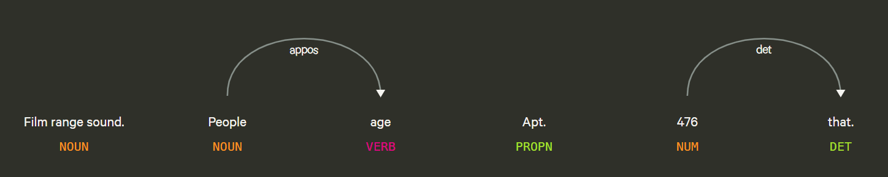
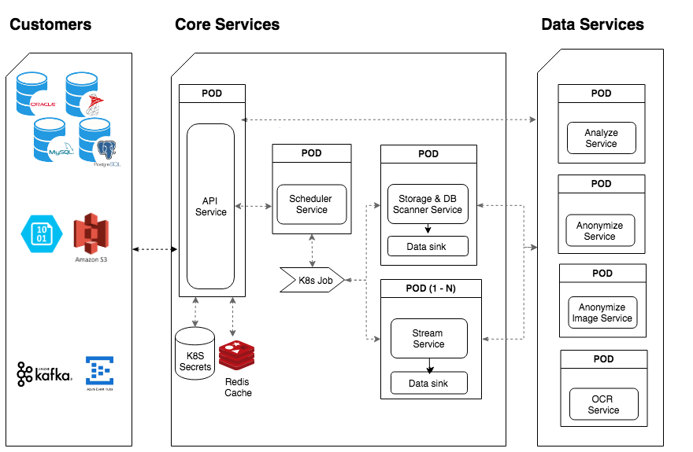
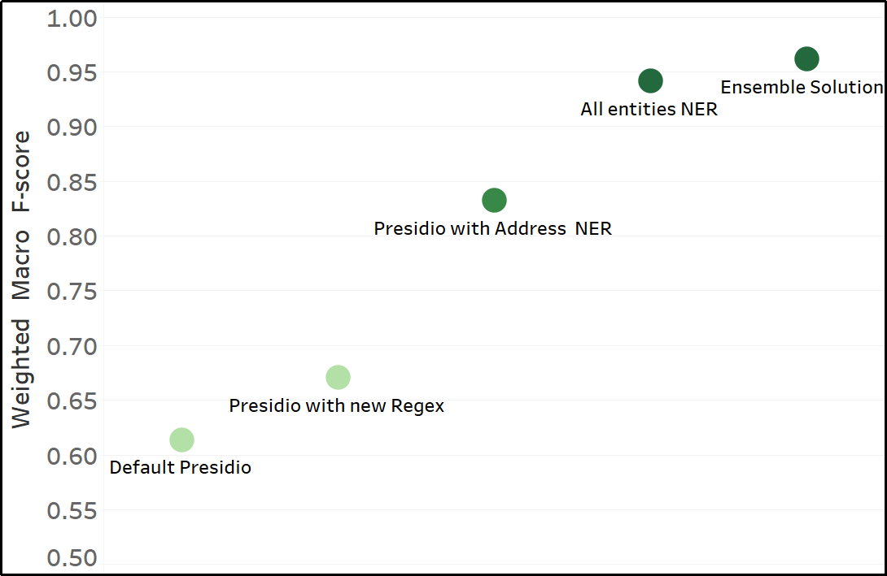
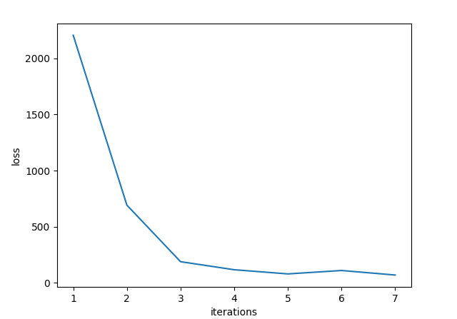
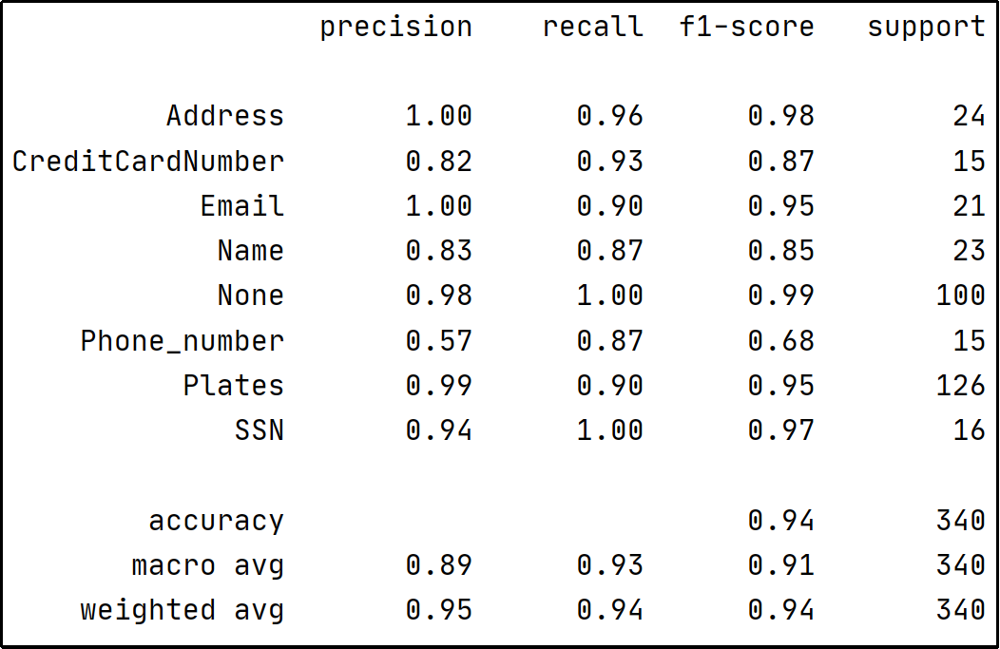
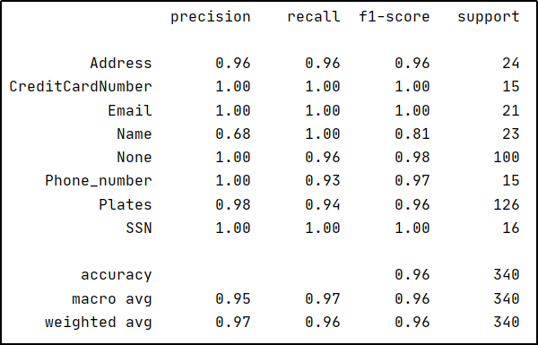

# PII Classification Project Report

## Summary

The current project involves recognizing if a given text contains the Personally identifiable information (PII) labels (entity); Name, Address, Credit Card Number, SSN, Phone Number, Plates, or Email, and annotate the exact text that contains the entity. The main challenge is to have a balance between a machine learning model and a pattern-based approach. The ML model helps to capture more entities, but with a higher loss value, versus the pattern-based that provides the best solution on entities like Card Number, SSN, and Phone Number.

### Data Exploration

The training set contains 800 rows with text, entity, and PII value. There are 100 rows of data for each entity and another 100 labeled as None. Another set of 16000 text rows is available to predict the labels.

_Fig 1: Context break down_

*   The given data contains PII values out of context as shown in the above figure, which will adversely affect heavy reliance on contextual parameters
*   Credit card data comprise of values with 12-16+ digits, but not all of them adhere to the Luhn checksum for credit cards
*   Phone Numbers data contain extensions and country code in non-standard formats
*   Plates data does not show any patterns that are US or any country-specific

### Solution

The intellection of the solution started with identifying the capable and easily scalable options to solve the problem. This exploration resulted in the use of Microsoft Presidio and spaCy, which are open source and easily scalable solutions. Both the libraries provide a good start to build the custom solution for the targeted problem. Understanding the right set of knowledge and factors from the two technologies were needed to set up the assumptions and parameters in the services. These things were revised continuously based on the weighted macro F-score metrics obtained at each version of the solution.

After multiple versions of the solution, a simple ensemble of pattern-based recognizers (Presidio) and a neural network-based model (spaCy) provided the best results (F-score: 0.96, Loss: 35). The final solution always uses pattern-based recognizers for Phone Number, SSN, Email, and Credit Card. Apart from that, spaCy picks up edge cases for Credit Card or Phone Number that don't follow the conventional patterns. The entities, Name, Address, and Plates, benefit from the contextual understanding of both spaCy and Presidio.

## Approach

The problem at hand is to classify and recognize a part of the information in an unstructured text. Specifically, the project deals with seven labels (Name, Address, Credit Card Number, SSN, Phone Number, Plates, and Email) that are PII entities, and the unstructured text input is a single text sentence. A more formal term for this use-case is Named Entity Recognition(NER), which falls under the domain of Information Retrieval. This project only deals with Regular Expressions and Machine Learning based recognizers. 

The desirable way to implement the recognizers should consider two main factors; reproducing the solution at a large scale and getting faster outcomes. So the best solution will involve a scalable architecture and supported pipelines.

Why Presidio?

_Fig 2: Presidio As a Service - Kubernetes Deployment ([Source](https://github.com/microsoft/presidio/blob/master/docs/design.md))_

Microsoft Presidio provides fast analytics and anonymization features to solve data privacy problems. It is an open-source service that is production-ready and leverages a set of recognizers, each trained and capable of detecting multiple PII entities in many languages. The service can handle different entities out of the box (CREDIT_CARD, EMAIL_ADDRESS, PHONE_NUMBER, PERSON, US_SSN, and more). The advantages of using Presidio are; the support to build new recognizers for the pre-configured entities and add new entities. Any new recognizers can leverage; Regular Expressions and validation with context for pattern-based entities; Blacklist for a finite list of options; Rule-based for specific identifiable entities; and NER for entities that require natural language understanding. 

Solution Evaluation

_Fig 3: Weighted Macro F-score of different models_

The initial approach for the solution uses Presidio with the pre-configured fields and recognizers. The pattern-based recognizers leverage Regular Expressions and validation (checksum) along with the context of surrounding words. The natural language entities utilize NER. The available recognizers are pre-configured on a broad range of data, that contributed to a weighted macro F-1 score of** 0.62**.

The second iteration of the solution involved updating Presidio recognizers with new Regex to capture Phone Numbers with extensions and US country code (e.x: +1-552-819-0522x1680), and a custom Regex to recognize Plates. This version of the solution identifies Address and Plates information with a low precision. Along with that, not all Address entities are captured, which results in a low recall value. This performance is because of the lack of training of the address recognizer on just street addresses (e.x: 425 Jones Expressway Suite 280) and because of poor Regex in the case of Plates recognizer. The solution ended up with a weighted macro F-1 score of **0.67**.

The next version tries to improve the address recognizer with the use of a custom NER model. spaCy is considered for the model development as it is an open-source software library available with advanced natural language algorithms. It provides an easy and elegant way to build custom entities using NER. So, the third flavor of the solution uses the spaCy address model with Presidio recognizers to identify the labels. This solution resulted in improved precision and recall related to Address entities. But there are cases where false values of Address and Plates are recognized, affecting the precision metric. The best model output among both possible directions, running spaCy first and Presidio later and vice-versa, resulted in a weighted macro F-1 score of **0.83**.

_Fig 4: 890- value per iteration_

A new NER model to detect all the entities is the next version of the solution. The training of this model involved hyperparameter tuning by updating and testing with Loss, dropout rate, and no. of iterations. Finally, the model convergence was achieved with seven iterations and came out with a loss value of 35 while using a dropout rate of 0.25. Upon testing the model with the test split from the training data, it performed the best with a weighted macro F-1 score of **0.94**.

After a detailed observation, the NER model performs poorly with fixed pattern entities like Phone Numbers, SSN, and Credit Card Number compared to the previously discussed solutions. But considering the model is now trained covering multiple entities, it can easily differentiate between Address and other entities, which results in higher precision for Address. The Plates entity that previously suffered from capturing all the different values got a boost from using the machine learning approach since the Plates contain data values that are harder to explain using patterns.

_Fig 5: Classification metrics all entities NER model_

A few things to consider on top of the overall metrics are; the PII entities like SSN and Credit Card Number take higher preference over the entities like Address, Plates, and Name. The reason behind this is the first set of PII values are considered critical information and would undergo greater scrutiny compared to the others. Also, the second set of PII values are more likely to have a wider variety of data and have a greater scope to grow as trained with new data compared to the fixed pattern entities. 

## Final Solution

Now, coming to the final solution, the principal objective is to improve the recall and precision for the high sensitivity metrics like SSN and Credit Card Numbers. Furthermore, it should consider adopting pattern-based recognizers as a base level without entirely relying on a NER model.

The final solution employs both the custom NER model and the updated Presidio recognizers to accomplish the two objectives. Since spaCy and Presidio recognizers are working together to solve the same problem, this makes it an ensemble solution.  The logic in place that combines the results from the two models goes like this:

*   If both models identify the same:
    *   return that
*   If not:
    *   return Presidio result if it's an SSN, Credit Card, Email address or Phone Number
    *   return spaCy prediction if it's an Address
    *   return Presidio output
*   In any case, if there is only prediction, return that entity
*   If both do not provide a result, then return None

_Fig 6: Classification metrics ensemble solution_

To conclude, the logic on top of the two models makes sure that the spaCy model stays aligned with the pattern-based recognizers and until it has learned enough to grow past them. In the meantime, we are focusing on having the best precision and recall on sensitive entities. Recognizers that will improve significantly with more training would be the Address, Name, and Plates allowing the solution to have an even better score. Finally, the best solution has a F-1 score of **0.96**.

## Next Steps

### Integrated Solution

Integrating spaCy with other pre-configured recognizers opens up the potential to utilize Presidio's data pipelines and scalable services. This integration involves extending the EntityRecognizer Python class part of the Presidio-Analyzer package. With the integrated solution, Presidio handles the predictions by providing scores to each recognition. A base-level score is assigned when extending the class, and this score gets updated if supporting context information is available.

### Training the spaCy model

The spaCy model trained for this project is saved in a folder that can be reused to retrain and update the model, this process is known as transfer learning. Once the model is reloaded, the Address entity can be retrained on data available online like OpenStreetMaps and Open addresses. This will help prepare Address to handle more variety of street addresses and locations. It’s also important to not over-train the model on just one entity as that would eventually result in prediction degradation for other entities.

### Improved Testing

Along with testing the identified labels, the model needs to be tested on the annotations detected as there will be predictions where the label will be identified correctly but not the entire annotation is detected. spaCy has an interactive semi-automatic enterprise tool Prodigy to facilitate the process. Another open-source option to consider is doccano.
